# Testing

> [!NOTE]  
> Return back to the [README.md](README.md) file.

## Code Validation

### HTML

I have used the recommended HTML W3C Validator to validate all of my HTML files.

| Directory | File | URL | Screenshot | Notes |
| --- | --- | --- | --- | --- |
| market | [index.html](https://github.com/Karla-Stein/mentor-market/blob/main/market/templates/market/index.html) | [HTML Validator](https://validator.w3.org/nu/?doc=https%3A%2F%2Fmy-mentor-market-e1c13c4d04df.herokuapp.com%2F) | 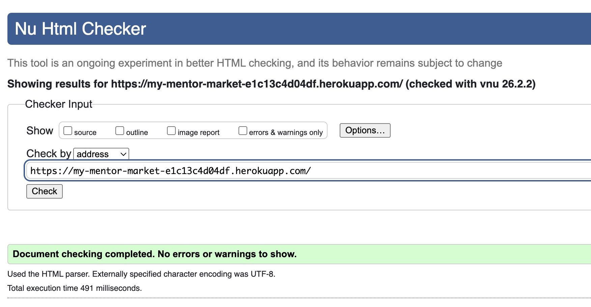 | Homepage does not require log-in, hence validated via URL |
| market | [profile_detail.html](https://github.com/Karla-Stein/mentor-market/blob/main/market/templates/market/profile_detail.html) | [HTML Validator](https://validator.w3.org/nu/?doc=https%3A%2F%2Fmy-mentor-market-e1c13c4d04df.herokuapp.com%2Fkarla-steinbrink%2F) | 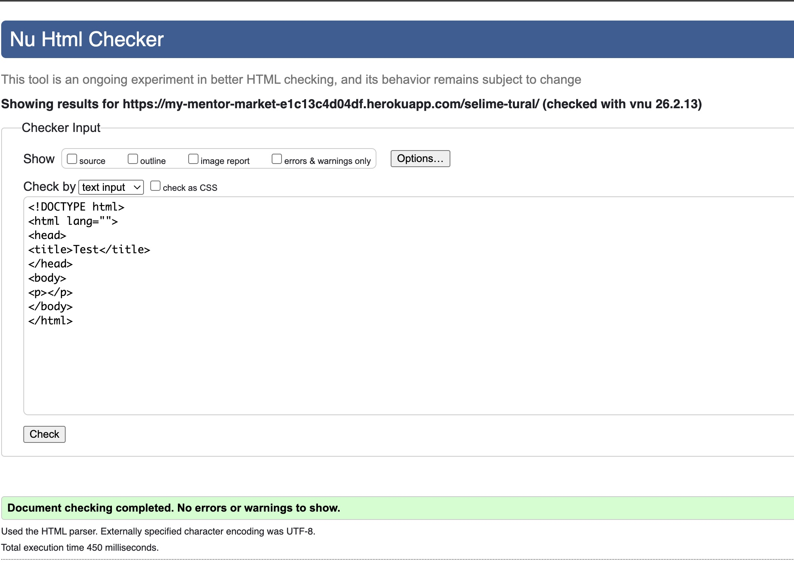 | Detailed profile page does not require log-in, hence validated via URL. |
| market | [profile_setup.html](https://github.com/Karla-Stein/mentor-market/blob/main/market/templates/market/profile_setup.html) |  | 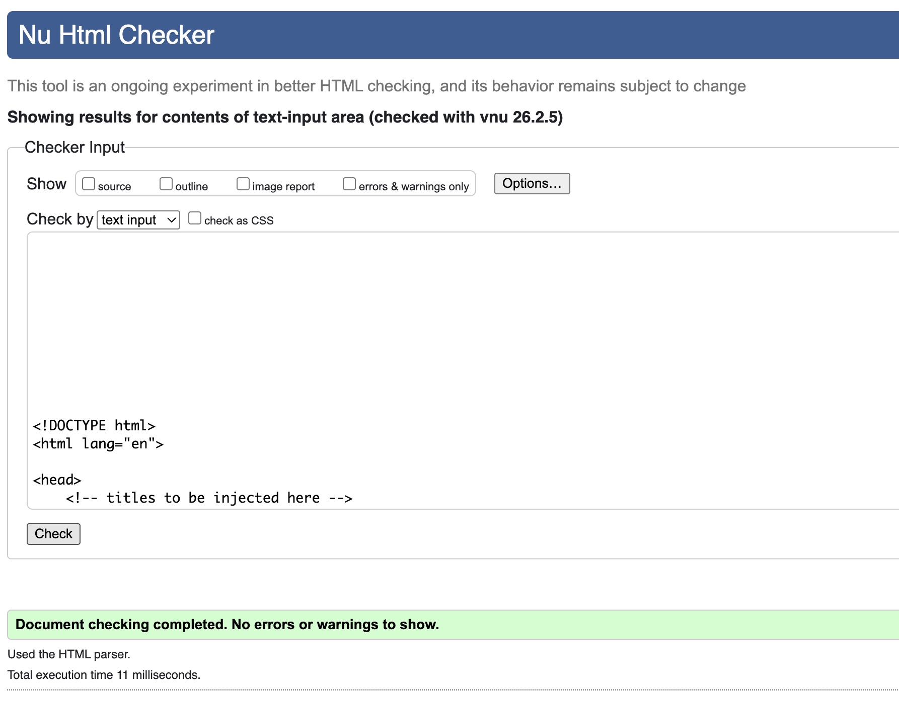 | Log in required, hence validated by input. |
| market | [profile_setup.html]((https://github.com/Karla-Stein/mentor-market/blob/main/market/templates/market/profile_setup.html)) | edit-profile/ | 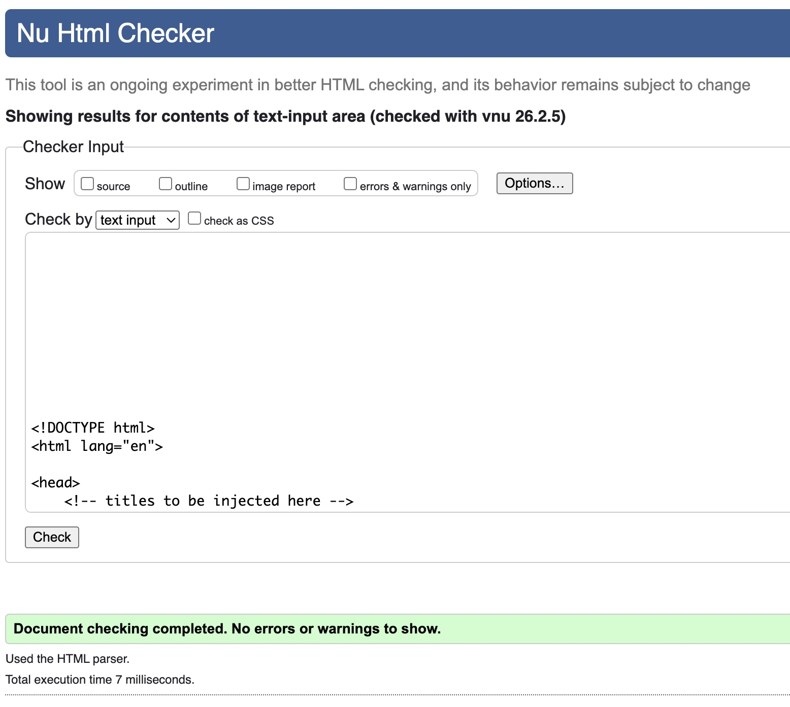 | Edit route uses profile_setup template. Login required, hence validated by input. |
| market | [availability.html](https://github.com/Karla-Stein/mentor-market/blob/main/market/templates/market/availability.html) |  | 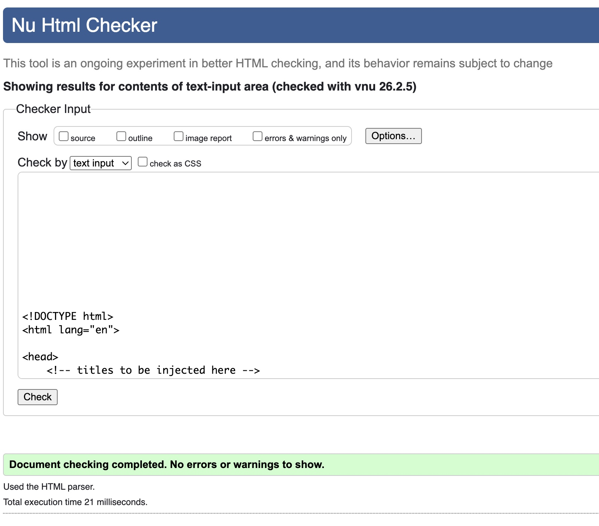 |  Log in required, hence validated by input.|
| market | [availabilityp.html](https://github.com/Karla-Stein/mentor-market/blob/main/market/templates/market/availability.html)|  edit-availability/<pk> | 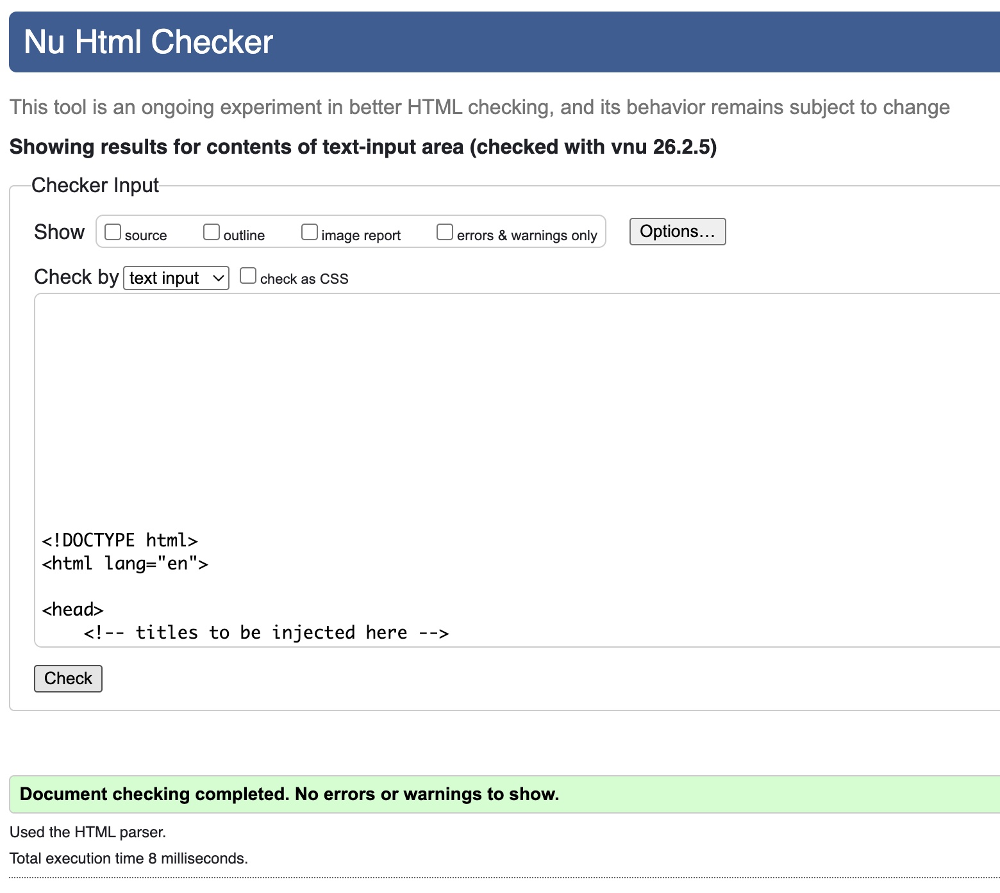 | Edit route uses availability template. Login required, hence validated by input.|
| booking | [booking_details.html](https://github.com/Karla-Stein/mentor-market/blob/main/booking/templates/booking/booking_details.html) |  | 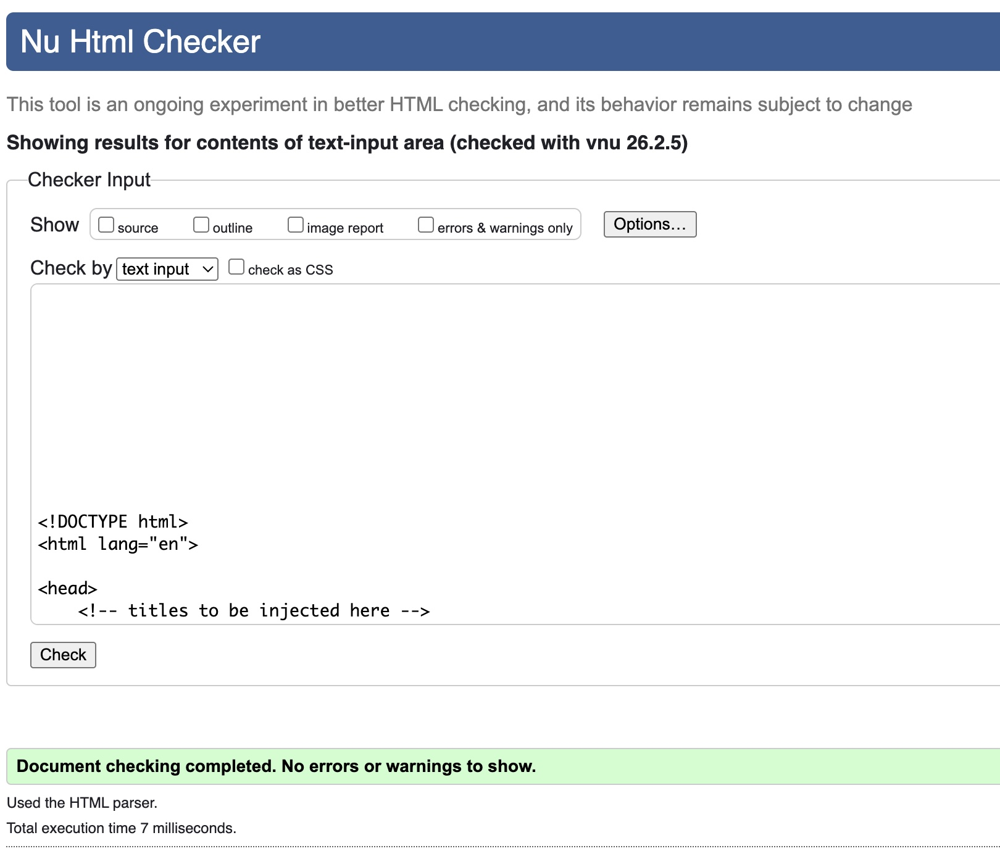 |  Log in required, hence validated by input. |
| booking | [booking.html](https://github.com/Karla-Stein/mentor-market/blob/main/booking/templates/booking/booking.html) | [HTML Validator](https://validator.w3.org/nu/?doc=https%3A%2F%2Fmy-mentor-market-e1c13c4d04df.herokuapp.com%2Fbooking%2Fbook-a-slot%2F75) | 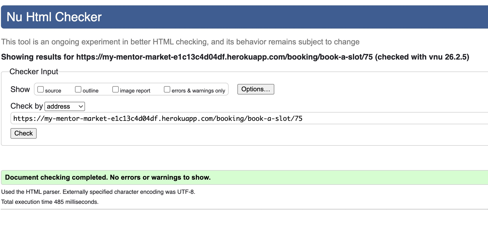 | Booking page does not require log-in, hence validated via URL. |

> **Note:**  
> Authentication-related templates (login, logout, signup, password reset) are provided by `django-allauth`.  
> They were not modified as part of this project and only inherit global styling via the base template.  
> As no custom HTML structure was introduced, I excluded these templates from manual HTML validation.

### CSS

I have used the recommended [CSS Jigsaw Validator](https://jigsaw.w3.org/css-validator) to validate all of my CSS files.

| Directory | File | URL | Screenshot | Notes |
| --- | --- | --- | --- | --- |
| static | [style.css](https://github.com/Karla-Stein/mentor-market/blob/main/static/css/style.css) | [CSS Jigsaw Validator](https://jigsaw.w3.org/css-validator/validator?uri=https%3A%2F%2Fmy-mentor-market-e1c13c4d04df.herokuapp.com%2Fstatic%2Fcss%2Fstyle.css&profile=css3svg&usermedium=all&warning=1&vextwarning=&lang=en#warnings)| 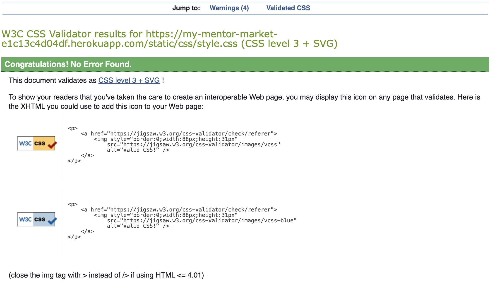 | |
| static | [style.css](https://github.com/Karla-Stein/mentor-market/blob/main/static/css/style.css) | [CSS Jigsaw Validator](https://jigsaw.w3.org/css-validator/validator?uri=https%3A%2F%2Fmy-mentor-market-e1c13c4d04df.herokuapp.com%2Fstatic%2Fcss%2Fstyle.css&profile=css3svg&usermedium=all&warning=1&vextwarning=&lang=en#warnings)| 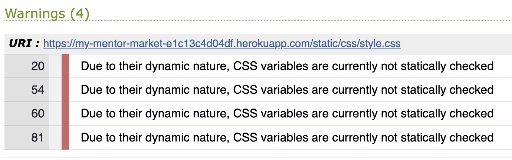 | CSS validation produced warnings related to CSS custom properties (variables). These warnings are expected due to the dynamic nature of CSS variables and do not affect functionality or browser compatibility. |

### Javascript

I have used the recommended [JShint Validator](https://jshint.com) to validate my JS files.

| Directory | File | Screenshot | 
| --- | --- | --- | 
| static | [availability_delete.js](https://github.com/Karla-Stein/mentor-market/blob/main/static/js/availability_delete.js) | 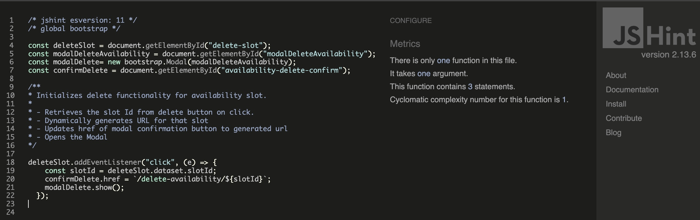 |  
| static | [profile_delete.js](https://github.com/Karla-Stein/mentor-market/blob/main/static/js/profile_delete.js) |  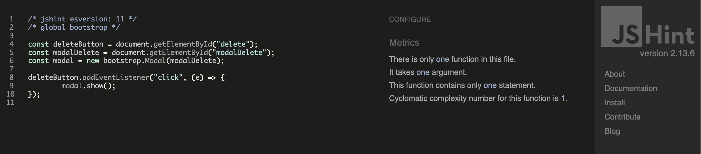 |  

### Python

I have used the recommended [PEP8 CI Python Linter](https://pep8ci.herokuapp.com) to validate all of my Python files.

| Directory | File | URL | Screenshot | Notes |
| --- | --- | --- | --- | --- |
| mentor_market | [settings.py](https://github.com/Karla-Stein/mentor-market/blob/main/mentor_market/settings.py) | [PEP8 CI Link](https://pep8ci.herokuapp.com/https://raw.githubusercontent.com/Karla-Stein/mentor-market/refs/heads/main/mentor_market/settings.py) | 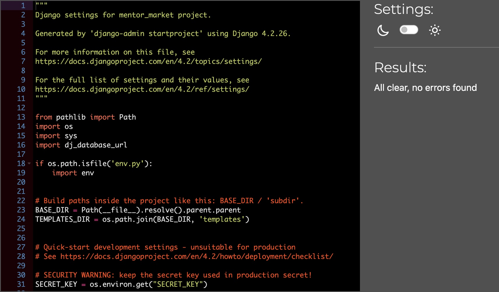 | ⚠️ Notes (if applicable) |
| mentor_market | [urls.py](https://github.com/Karla-Stein/mentor-market/blob/main/mentor_market/urls.py) | [PEP8 CI Link](https://pep8ci.herokuapp.com/https://raw.githubusercontent.com/Karla-Stein/mentor-market/refs/heads/main/mentor_market/urls.py) | 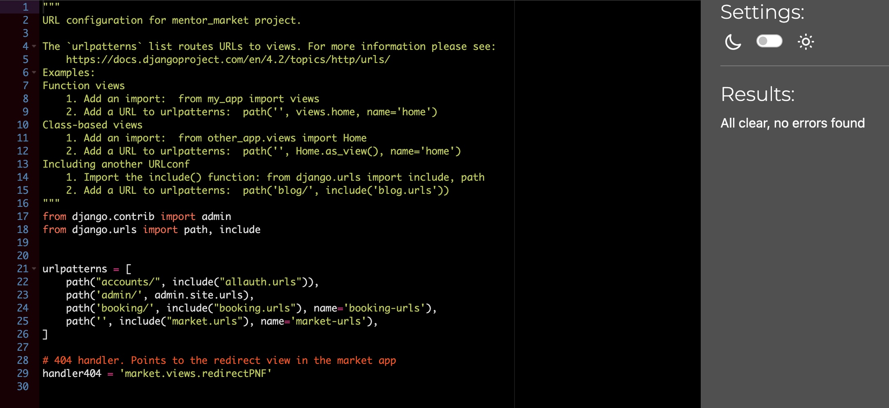 | ⚠️ Notes (if applicable) |

## Lighthouse Audit

I've tested my deployed project using the Lighthouse Audit tool to check for any major issues. Some warnings are outside of my control, and mobile results tend to be lower than desktop.

| Page | Mobile | Desktop |
| --- | --- | --- |
| Home |  | 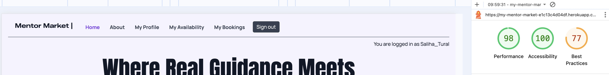 |
| My Profile |  | 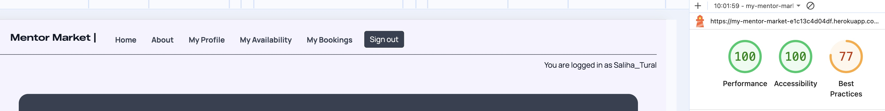 |
| My availability |  | 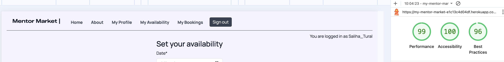 |
| My Bookings |  | 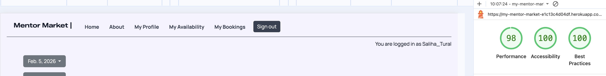 |
| Profile setup  | 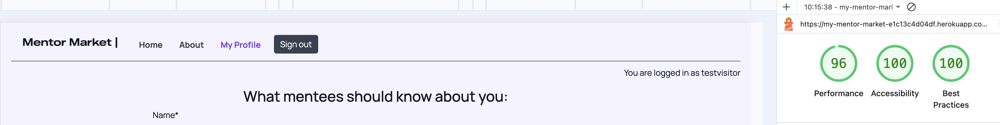 |  |
| Booking Form |  | 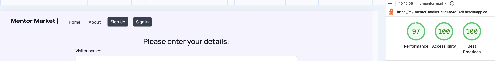 |
| 404 |  |  |

